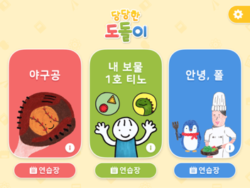
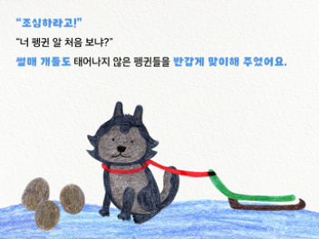
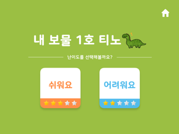
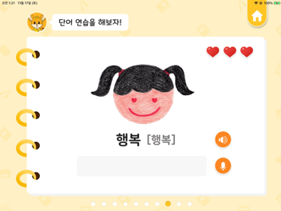
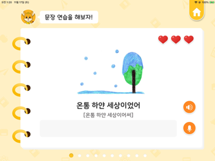
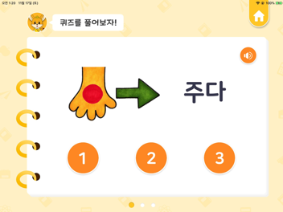
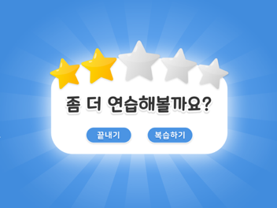
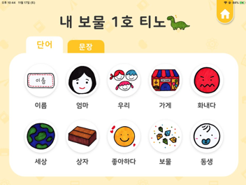

# Dodori  
**인공와우 수술을 한 청각장애아동의 조음훈련을 돕는 앱, <당당한 도돌이>**

서울여대 콘텐츠디자인학과 위풍당당팀 졸업 프로젝트

##팀원 소개

기획 : 이예진

디자인 : 김채윤, 이윤지

개발 : [이재은](https://github.com/Jae-eun)

## 활용 기술

* [**네이버 Clova Speech Recognition API**](https://www.ncloud.com/product/aiService/csr) : 음성 데이터를 인식한 후, 텍스트로 변환하여 조음훈련에 활용함.
* [**Lottie**](https://github.com/airbnb/lottie-ios) : 보다 효율적인 애니메이션 효과 제작에 사용함. svg 즉, 벡터로 gif보다 선명한 화질을 제공할 수 있음.

#  

* **메인 화면** : 3가지의 동화 컨텐츠 선택

* **동화 화면** : 동화를 읽어주는 성우 음성, 움직이는 이미지 애니메이션 및 효과음 제공

* **난이도 선택 화면** : 훈련 난이도 선택 및 이전 훈련 결과 제공

* **단어 훈련 화면** : 제시된 단어의 발음을 듣고 따라하는 훈련

  ​					 	다르게 발음한 글자를 빨간색으로 표시함.

* 문장 훈련 화면 : 제시된 문장의 발음을 듣고 따라하는 훈련

  ​						 다르게 발음한 글자를 빨간색으로 표시함.

* 퀴즈 화면 : 제시된 단어와 유사한 발음을 듣고 정확한 소리를 맞추는 퀴즈

* 결과 화면 : 훈련에 대한 결과 제공

* 복습 화면 : 정확히 발음하지 못한 단어와 문장을 선택하여 다시 연습할 수 있음.

